# Factory ERP System - Architecture & Flow Documentation

## 🏗️ System Architecture Overview

### High-Level Architecture
```
┌─────────────────────────────────────────────────────────┐
│                    Client Layer                         │
│  ┌─────────────┐  ┌─────────────┐  ┌─────────────┐     │
│  │   Web App   │  │ Mobile App  │  │   Admin     │     │
│  │  (React)    │  │(React Native│  │   Panel     │     │
│  └─────────────┘  │/Flutter)    │  └─────────────┘     │
│                   └─────────────┘                       │
└─────────────────────────────────────────────────────────┘
                            │
                    ┌───────▼───────┐
                    │  Load Balancer │
                    │   (Nginx)      │
                    └───────┬───────┘
                            │
┌─────────────────────────────────────────────────────────┐
│                 Application Layer                       │
│  ┌─────────────┐  ┌─────────────┐  ┌─────────────┐     │
│  │   API       │  │   Auth      │  │ Notification│     │
│  │  Gateway    │  │  Service    │  │  Service    │     │
│  └─────────────┘  └─────────────┘  └─────────────┘     │
│                                                         │
│  ┌─────────────┐  ┌─────────────┐  ┌─────────────┐     │
│  │ Inventory   │  │ Production  │  │  Financial  │     │
│  │  Service    │  │  Service    │  │   Service   │     │
│  └─────────────┘  └─────────────┘  └─────────────┘     │
│                                                         │
│  ┌─────────────┐  ┌─────────────┐  ┌─────────────┐     │
│  │   Order     │  │  Security   │  │   Report    │     │
│  │  Service    │  │  Service    │  │  Service    │     │
│  └─────────────┘  └─────────────┘  └─────────────┘     │
└─────────────────────────────────────────────────────────┘
                            │
┌─────────────────────────────────────────────────────────┐
│                   Data Layer                            │
│  ┌─────────────┐  ┌─────────────┐  ┌─────────────┐     │
│  │ PostgreSQL  │  │    Redis    │  │   File      │     │
│  │ (Primary DB)│  │   (Cache)   │  │  Storage    │     │
│  └─────────────┘  └─────────────┘  └─────────────┘     │
└─────────────────────────────────────────────────────────┘
```

## 🔄 Core Business Flows

### 1. Order to Dispatch Flow
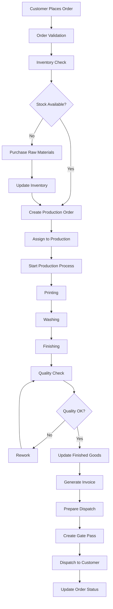

### 2. Inventory Management Flow
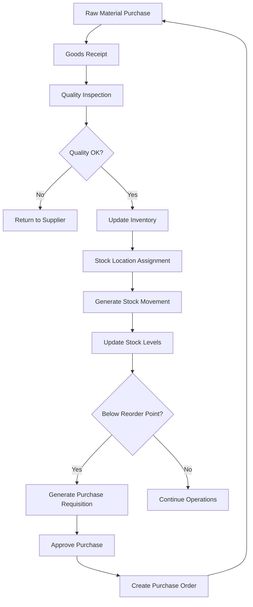

### 3. Production Planning Flow
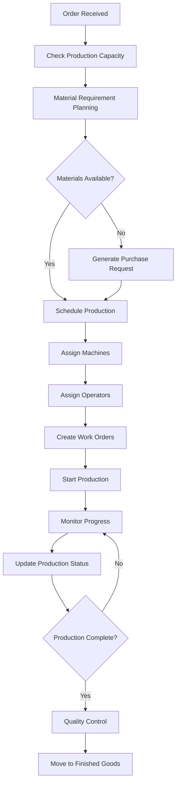

## 🔐 Security & Access Control Flow

### Authentication Flow
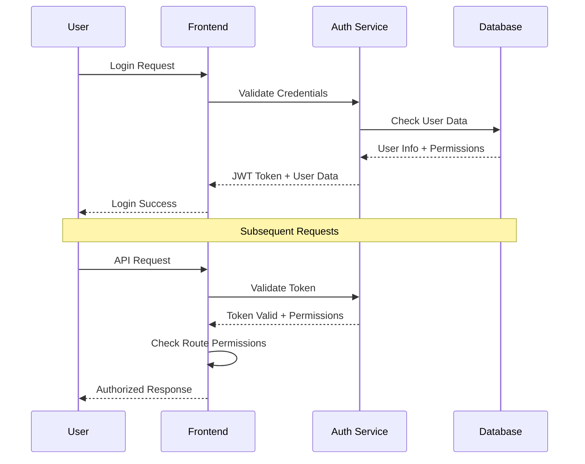

### Role-Based Access Control
```
Owner (Full Access)
├── Financial Management ✓
├── Production Management ✓
├── Inventory Management ✓
├── Order Management ✓
├── Security Management ✓
├── User Management ✓
└── Reports & Analytics ✓

Factory Manager
├── Production Management ✓
├── Inventory Management ✓ (View Only)
├── Order Management ✓ (Production Related)
├── Security Management ✓ (Factory Floor)
└── Reports ✓ (Production Reports)

Accountant
├── Financial Management ✓
├── Order Management ✓ (Billing Related)
├── Purchase Management ✓
└── Financial Reports ✓

Security Guard
├── Security Management ✓ (Limited)
├── Visitor Management ✓
├── Vehicle Logs ✓
└── Gate Pass ✓
```

## 📊 Data Flow Architecture

### Real-time Data Synchronization
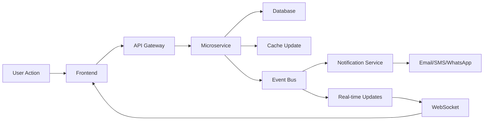

### Inventory Tracking Flow
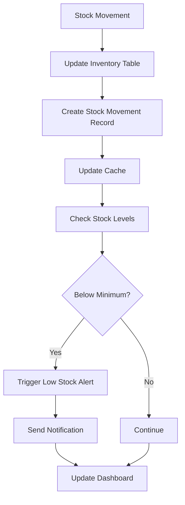

## 🔄 Integration Flows

### Third-Party Integrations
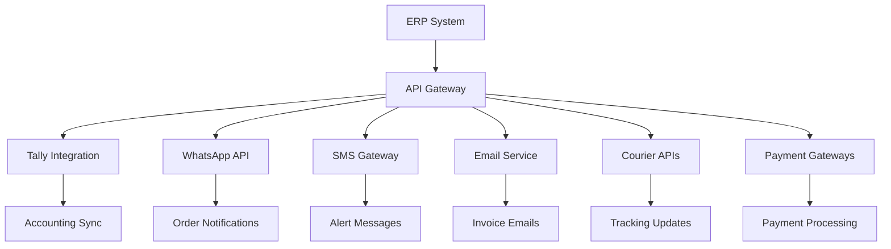

### File Upload & Document Management
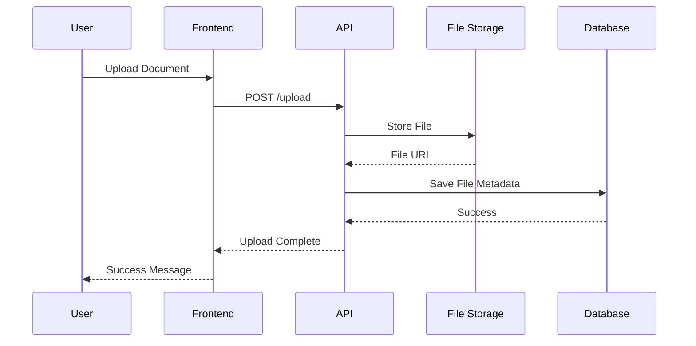

## 📱 Mobile App Architecture

### Mobile-Specific Flows
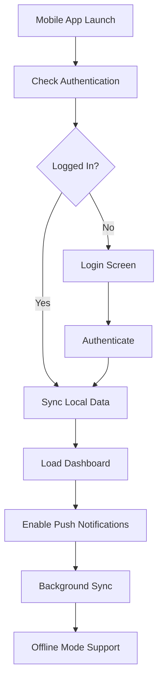

### Offline Capability
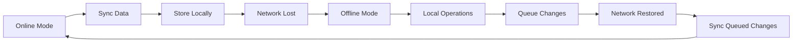

## 🚨 Error Handling & Recovery

### Error Flow
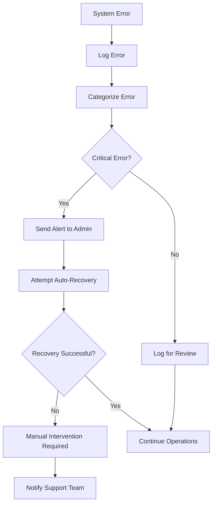

## 📈 Performance & Scalability

### Caching Strategy
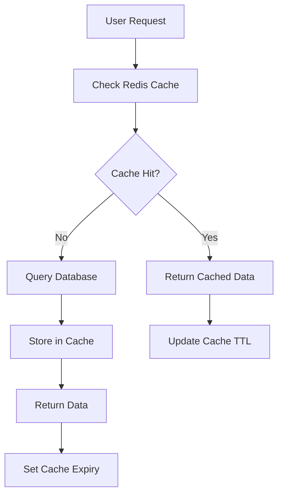

### Database Optimization
```
Read Replicas for Reports
├── Master Database (Write Operations)
├── Read Replica 1 (Dashboard Queries)
├── Read Replica 2 (Report Generation)
└── Read Replica 3 (Analytics)

Partitioning Strategy
├── Orders by Date (Monthly Partitions)
├── Stock Movements by Date (Weekly Partitions)
├── Transactions by Date (Monthly Partitions)
└── Logs by Date (Daily Partitions)
```

## 🔄 Backup & Recovery

### Backup Strategy
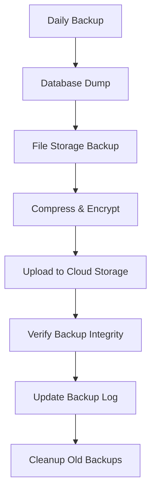

### Disaster Recovery
```
Recovery Time Objectives (RTO)
├── Critical Systems: 1 hour
├── Production Systems: 4 hours
├── Reporting Systems: 24 hours
└── Archive Systems: 72 hours

Recovery Point Objectives (RPO)
├── Financial Data: 15 minutes
├── Production Data: 1 hour
├── Inventory Data: 30 minutes
└── User Data: 4 hours
```

This architecture provides a robust, scalable foundation for the Factory ERP system with proper separation of concerns, security, and performance optimization.
