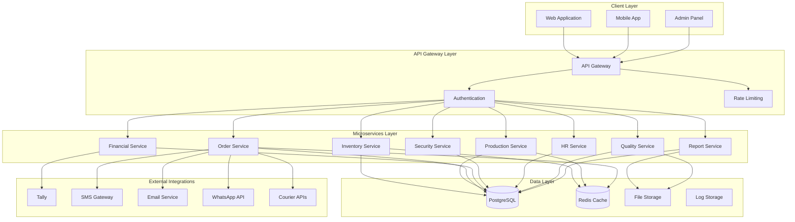
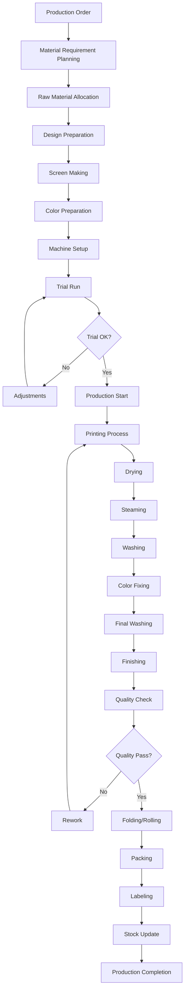
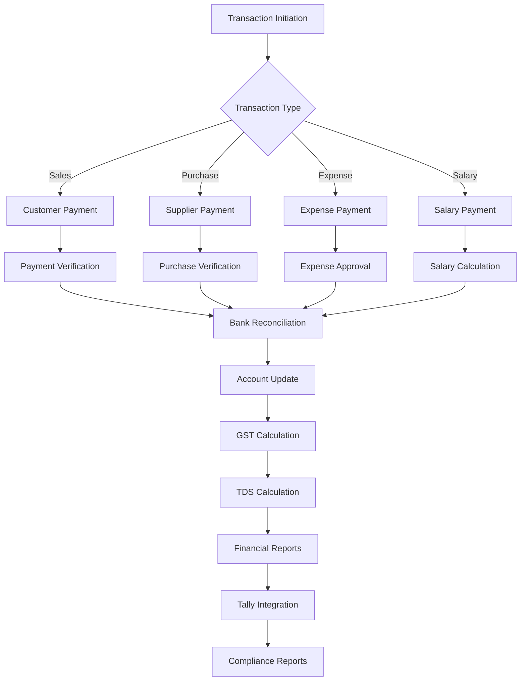
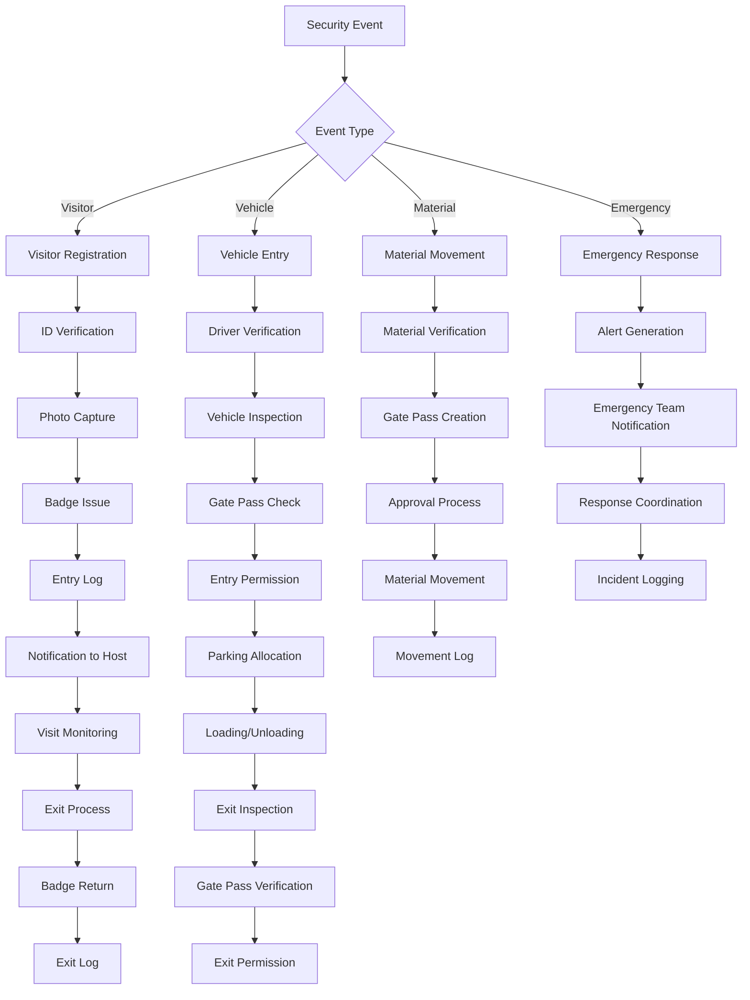
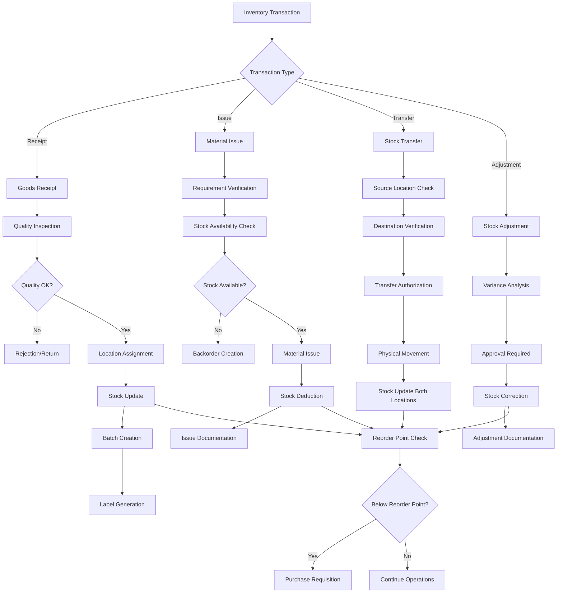
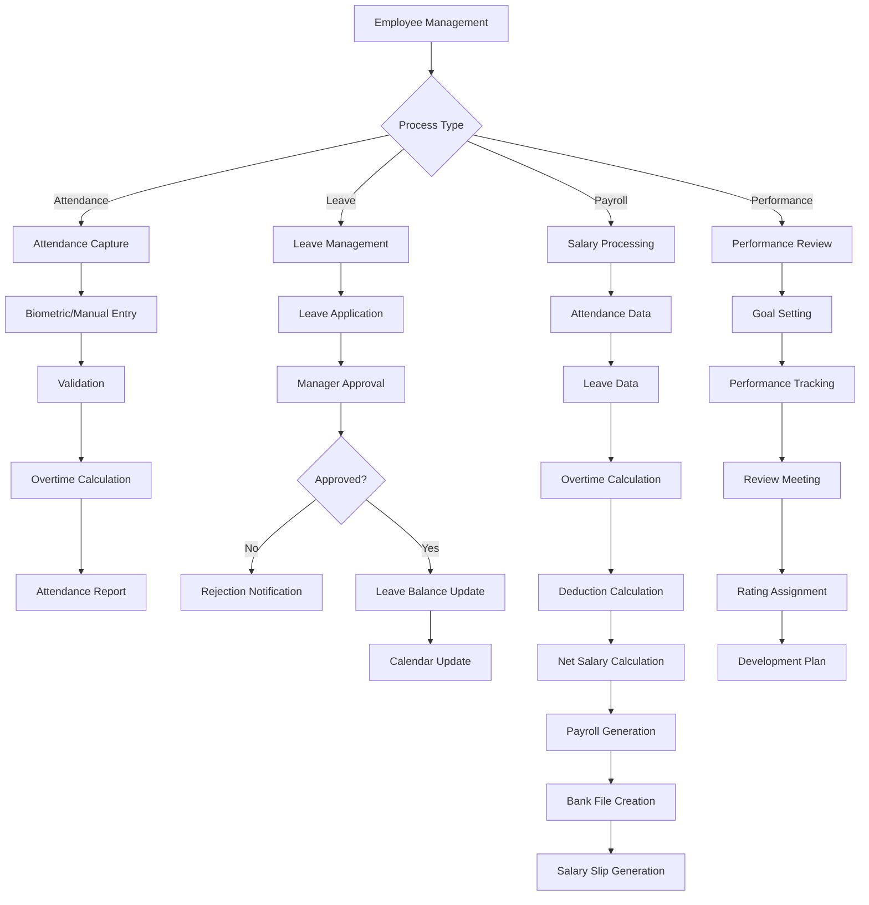
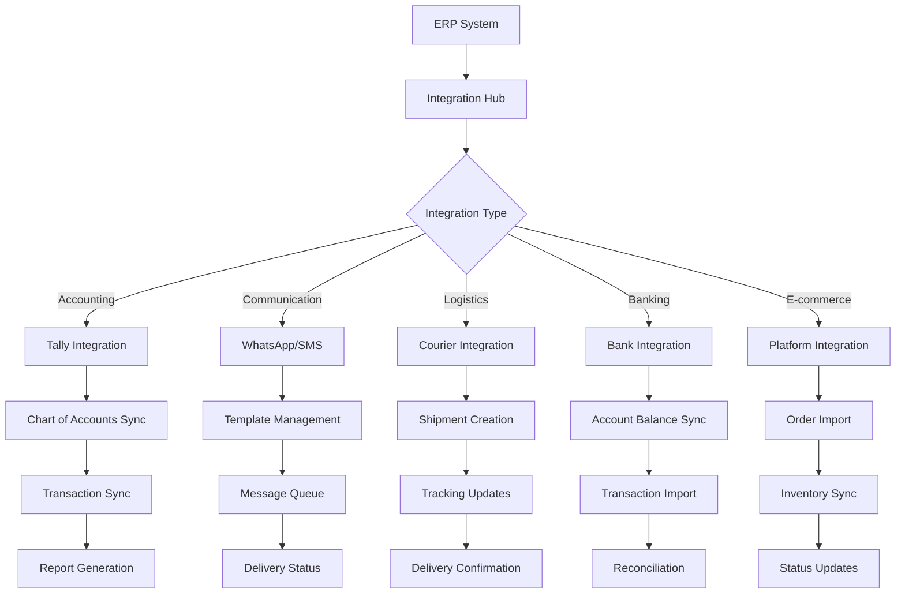

# Factory ERP System - Complete Flow Diagrams

## 🔄 Master System Architecture Flow

### Overall System Flow

## 📦 Complete Order to Dispatch Flow

### Detailed Order Processing Flow

```mermaid
graph TD
    A[Customer Inquiry] --> B[Quotation Generation]
    B --> C[Customer Approval]
    C --> D[Order Creation]
    D --> E[Order Validation]
    E --> F{Credit Check}
    F -->|Failed| G[Credit Approval Required]
    F -->|Passed| H[Inventory Availability Check]
    G --> I[Management Approval]
    I --> H
    H --> J{Stock Available?}
    J -->|No| K[Raw Material Planning]
    J -->|Yes| L[Production Planning]
    K --> M[Purchase Requisition]
    M --> N[Supplier Selection]
    N --> O[Purchase Order Creation]
    O --> P[Material Receipt]
    P --> Q[Quality Inspection]
    Q --> R{Quality OK?}
    R -->|No| S[Return to Supplier]
    R -->|Yes| T[Stock Update]
    T --> L
    S --> N
    L --> U[Production Order Creation]
    U --> V[Machine Allocation]
    V --> W[Operator Assignment]
    W --> X[Material Issue]
    X --> Y[Production Start]
    Y --> Z[Process Monitoring]
    Z --> AA[Quality Checks]
    AA --> BB{Quality Pass?}
    BB -->|No| CC[Rework/Rejection]
    BB -->|Yes| DD[Finished Goods Receipt]
    CC --> Y
    DD --> EE[Final Quality Inspection]
    EE --> FF{Final QC Pass?}
    FF -->|No| GG[Hold/Rework]
    FF -->|Yes| HH[Packing]
    GG --> EE
    HH --> II[Invoice Generation]
    II --> JJ[Dispatch Planning]
    JJ --> KK[Gate Pass Creation]
    KK --> LL[Vehicle Loading]
    LL --> MM[Security Check]
    MM --> NN[Dispatch]
    NN --> OO[Tracking Update]
    OO --> PP[Delivery Confirmation]
    PP --> QQ[Payment Collection]
    QQ --> RR[Order Closure]
```

## 🏭 Production Process Flow

### Detailed Production Workflow

## 💰 Financial Process Flow

### Complete Financial Workflow

## 🔐 Security Management Flow

### Complete Security Workflow

## 📊 Inventory Management Flow

### Complete Inventory Workflow

## 👥 HR & Payroll Flow

### Complete HR Management Workflow

## 🔄 Integration Flow

### External System Integration

This comprehensive flow documentation covers all major business processes in the Factory ERP system with detailed workflows for each module.
